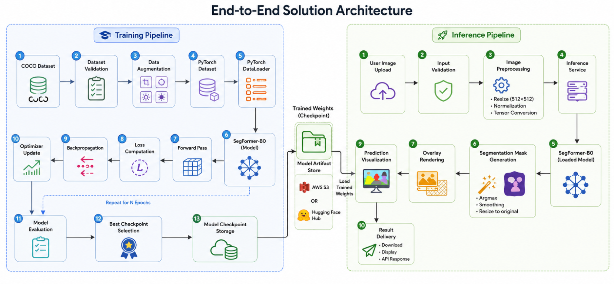
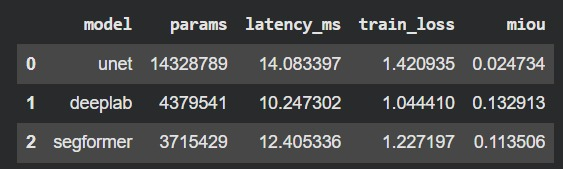
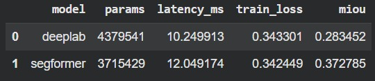

# Architecture Document

Infrastructure Defect Segmentation System
 
---

# Architecture Principles

The system design follows four architectural principles:

1. Modularity
   - Data processing, training, inference, and visualization are isolated into independent components.
   - Components can evolve independently without introducing changes across the entire system.

2. Reproducibility
   - Experiments are configuration-driven and versioned through structured checkpoint naming.
   - Training runs can be reproduced from configuration and dataset versions.

3. Deployability
   - The inference pipeline remains lightweight enough for deployment on free-tier cloud infrastructure.
   - Training and serving workloads remain decoupled.

4. Extensibility
   - New defect classes, datasets, or segmentation backbones can be integrated with minimal code changes.

---

# 1. Problem Overview

This project builds an end-to-end system that identifies infrastructure defects at the pixel level from inspection images.

Given an image of a concrete structure, the system generates a segmentation mask that highlights both the location and type of defect. The target defect categories are:

* Crack
* Spall
* Efflorescence
* Corrosion
* Background

Unlike image classification, which only predicts whether a defect exists, segmentation identifies the exact area affected by the defect. This level of detail supports inspection workflows, maintenance planning, reporting, and future measurement tasks.

The system targets a practical inspection workflow where engineers upload an image and receive a visual overlay showing detected defects.

---

# 2. High-Level System Architecture

# System Architecture


The system consists of four main stages:

1. Data preparation
2. Model training
3. Inference
4. Visualization

Each stage operates as an independent module. This structure keeps the codebase easier to maintain and allows future model replacements without major changes to the rest of the system.

---

# 3. Data Pipeline Design

## Dataset Selection

The project uses a publicly available infrastructure defect segmentation dataset stored in COCO segmentation format.

The dataset contains pixel-level annotations for several defect categories commonly found in concrete structures.

COCO format was selected for several practical reasons:

* Strong support across computer vision tools and libraries
* Straightforward validation and inspection
* Easy extension when adding new classes
* Compatibility with common annotation platforms

Using a widely adopted format also reduces friction when integrating future datasets.

---

## Dataset Validation

Before training, the dataset underwent a validation process to identify potential annotation issues.

Validation scripts checked for:

* Missing annotations
* Invalid polygons
* Empty masks
* Class distribution
* Dataset consistency

Poor annotations often create training instability and unreliable evaluation results. Early validation helps prevent these issues from affecting model performance.

---

## Class Imbalance

Infrastructure inspection datasets often contain a large imbalance between background pixels and defect pixels.

Most images contain large background regions, while some defect categories occupy only a small portion of the image. During dataset analysis, classes such as Spall and Efflorescence appeared much less frequently than Background.

To reduce this imbalance, class weighting was added to the loss function. This adjustment increases the contribution of underrepresented classes during training and helps prevent the model from favoring dominant classes.

---

## Data Augmentation

Data augmentation helps the model handle variations commonly found in real inspection images.

The augmentation pipeline includes:

* Horizontal flipping
* Vertical flipping
* Rotation
* Geometric transformations

The purpose is not simply to increase the number of training samples. Instead, augmentation exposes the model to different viewpoints, orientations, and image compositions that may appear during field inspections.

Since inspection images are often captured from different angles and distances, augmentation improves the model's ability to generalize beyond the training set.

---

# 4. Model Selection

## Candidate Model Evaluation

The project evaluated three semantic segmentation architectures:

- U-Net
- DeepLabV3+
- SegFormer-B0

Each model was trained using the same dataset split, augmentation pipeline, image resolution, and evaluation procedure to ensure a fair comparison.

### Initial Benchmark



The initial benchmark showed that both DeepLabV3+ and SegFormer-B0 significantly outperformed U-Net. U-Net struggled to learn meaningful segmentation boundaries on the dataset and was excluded from subsequent experiments.

### Refined Benchmark

After refining the training configuration and hyperparameters, DeepLabV3+ and SegFormer-B0 were re-evaluated.




## Selected Model: SegFormer-B0

SegFormer-B0 achieved the highest segmentation quality with an mIoU of 0.373, outperforming DeepLabV3+ by approximately 31.8% relative improvement while maintaining comparable inference latency.

| Model | Parameters | Latency (ms) | mIoU |
|---------|------------|-------------|-------------|
| DeepLabV3+ | 4.38M | 10.25 | 0.283 |
| SegFormer-B0 | 3.72M | 12.05 | 0.373 |

The selection was driven by three observations:

1. SegFormer-B0 achieved the highest validation mIoU.
2. SegFormer-B0 required fewer parameters than DeepLabV3+.
3. The additional inference latency (~1.8 ms) was negligible relative to the improvement in segmentation quality.

Infrastructure defects such as cracks, corrosion, and spalling often appear as thin structures embedded within complex concrete textures. The transformer-based encoder in SegFormer-B0 captured long-range contextual information more effectively than the convolution-based alternatives evaluated in this project.

# 5. Training Pipeline

## Transfer Learning Strategy

Training a transformer-based segmentation model from scratch requires a large amount of labeled data.

The available dataset is relatively small compared to the datasets used to train modern vision models. Instead of starting from random initialization, the project uses pretrained SegFormer weights and fine-tunes them on the defect segmentation dataset.

This approach reduces training time, improves convergence, and allows the model to benefit from visual features learned from larger datasets.

---

## Loss Function

The training objective combines:

* Cross Entropy Loss
* Dice Loss

Cross Entropy Loss focuses on correct pixel classification.

Dice Loss focuses on overlap quality between predicted masks and ground-truth masks.

Each loss addresses a different aspect of segmentation performance. Combining both encourages accurate pixel predictions while also improving mask quality, particularly for smaller defect regions.

---

## Fine-Tuning Strategy

The project uses transfer learning rather than training from scratch.

Training follows three objectives:

1. Preserve general visual features learned during pretraining.
2. Adapt the decoder to infrastructure defect segmentation.
3. Improve performance on minority defect classes.

Key training decisions:

- Initialize from pretrained SegFormer-B0 weights.
- Resize all images to 512×512 for consistent batch processing.
- Apply geometric augmentation during training only.
- Use weighted cross-entropy and Dice loss to address class imbalance.
- Select the final checkpoint based on validation mIoU.

This strategy reduces convergence time while maximizing performance under limited training resources.

## Training Workflow

```text
Dataset
   │
   ▼
DataLoader
   │
   ▼
Augmentation
   │
   ▼
SegFormer
   │
   ▼
Loss Calculation
   │
   ▼
Backpropagation
   │
   ▼
Checkpoint Saving
```

The training process follows these steps:

1. Load a batch of images and masks
2. Apply augmentation
3. Generate predictions
4. Calculate loss
5. Update model weights
6. Run validation
7. Save checkpoints

The system tracks validation performance throughout training and stores the best-performing checkpoint based on validation mIoU.

# Final Training Configuration Chosen

| Parameter          | Value                                     |
| ------------------ | ----------------------------------------- |
| Backbone           | SegFormer-B0                              |
| Pretrained Weights | nvidia/segformer-b0-finetuned-ade-512-512 |
| Epochs             | 30                                        |
| Batch Size         | 32                                        |
| Learning Rate      | 0.001                                     |
| Input Resolution   | 512 × 512                                 |
| Loss Function      | Weighted Cross Entropy + Dice Loss        |

Best experiment:

```text
exp005_e30_b32_lr001_d5_c5
```

Best validation epoch:

```text
27
```

Best validation mIoU:

```text
0.5611
```

# Production Bottlenecks

The current implementation is optimized for assessment delivery rather than large-scale production workloads.

| Component | Limitation |
|------------|-------------|
| Model Inference | Single-model execution limits throughput |
| Image Upload | Large image sizes increase preprocessing latency |
| GPU Availability | Shared free-tier resources introduce queueing |
| Visualization | Overlay generation adds post-processing overhead |


# Architectural Rationale

The architecture prioritizes execution reliability, maintainability, and deployment simplicity over maximum model complexity.

The design deliberately separates training, inference, and visualization concerns to reduce coupling between components and simplify future enhancements.

Within the constraints of the assessment, this approach provides:

- Reproducible experimentation
- Efficient model training
- Maintainable code structure
- Straightforward deployment
- Clear scalability paths

The resulting system delivers an end-to-end infrastructure defect segmentation workflow while remaining adaptable to future datasets, model architectures, and deployment environments.

---

# 6. Inference Pipeline

During inference, the system accepts an uploaded image and prepares it for prediction.

The preprocessing stage includes:

1. Image resizing
2. Tensor conversion
3. Normalization

The model then generates a pixel-level prediction map.

The prediction map is converted into a colorized segmentation mask, and the system blends the mask with the original image to create an overlay.

This output allows users to quickly identify defect locations without inspecting raw prediction values.

---

# 7. Visualization Layer

The visualization layer generates three outputs:

* Original image
* Segmentation mask
* Overlay image

Maintenance and inspection teams typically rely on visual evidence when reviewing defects. Presenting only numerical outputs or raw masks would make interpretation more difficult.

The overlay image provides a direct comparison between the original structure and the predicted defect regions, making results easier to review and communicate.

---

# 8. Deployment Workflow

The deployment architecture remains intentionally lightweight.

```text
User
 │
 ▼
Web Interface
 │
 ▼
Inference API
 │
 ▼
SegFormer Model
 │
 ▼
Prediction Result
```

The system separates the user interface from the inference logic.

The web interface handles image uploads and result presentation, while the inference API manages preprocessing, model execution, and prediction generation.

This separation keeps deployment simple while allowing future upgrades to either component independently.

The target deployment environment uses free-tier cloud resources to demonstrate a complete working solution without introducing unnecessary infrastructure complexity.

---

# 9. Scalability Considerations

The current implementation focuses on the assessment scope. A production deployment would require additional considerations as usage grows.

## Larger Dataset

A significant increase in dataset size would introduce new training challenges.

Potential improvements include:

* Distributed training across multiple GPUs
* Dataset versioning and tracking
* Automated validation pipelines
* More structured experiment management

These additions would improve reproducibility and reduce operational overhead as the dataset expands.

---

## Higher Inference Volume

A larger number of prediction requests would require infrastructure changes.

Potential improvements include:

* Dedicated inference servers
* Batch inference processing
* Model caching
* Load balancing

These changes would improve throughput and reduce response times under heavier workloads.


# 10. Future Improvements

Several enhancements remain outside the scope of this assessment but would provide value in a production setting.

Potential future work includes:

* Additional defect categories
* Active learning workflows
* Semi-supervised training
* Temporal inspection analysis
* Video-based defect segmentation
* Multi-model ensemble approaches

