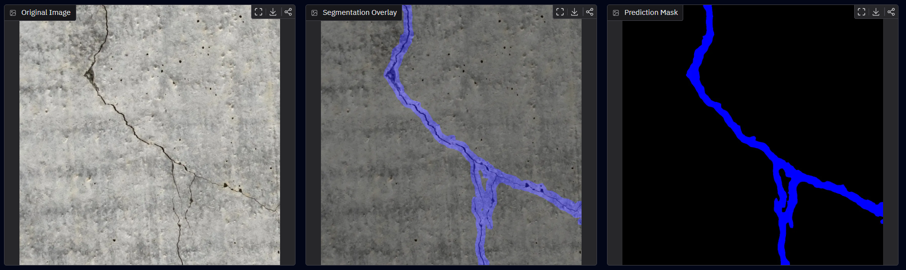
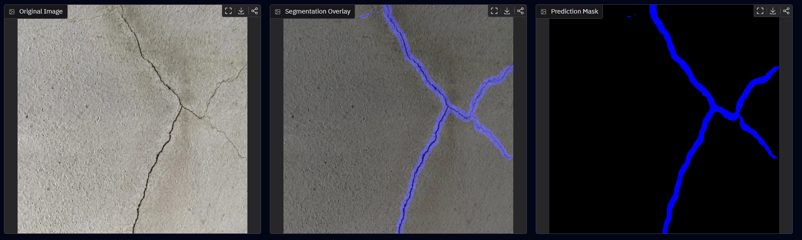
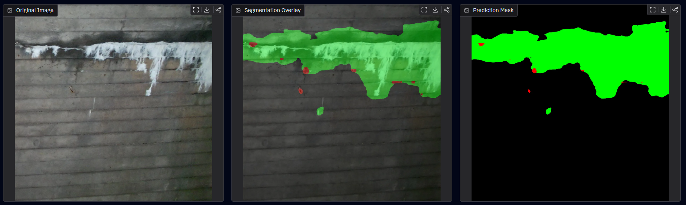
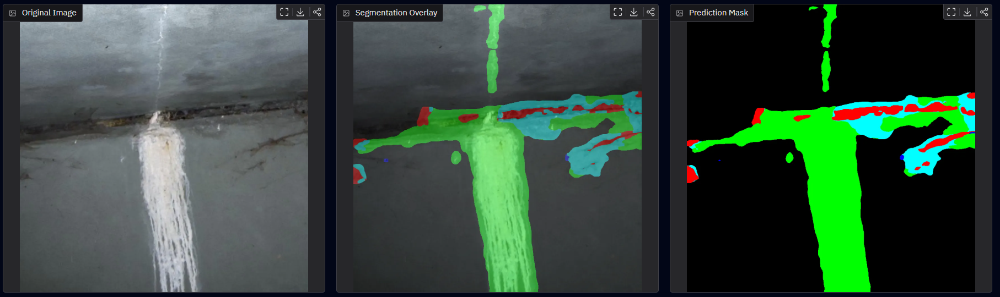
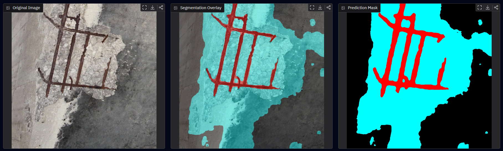
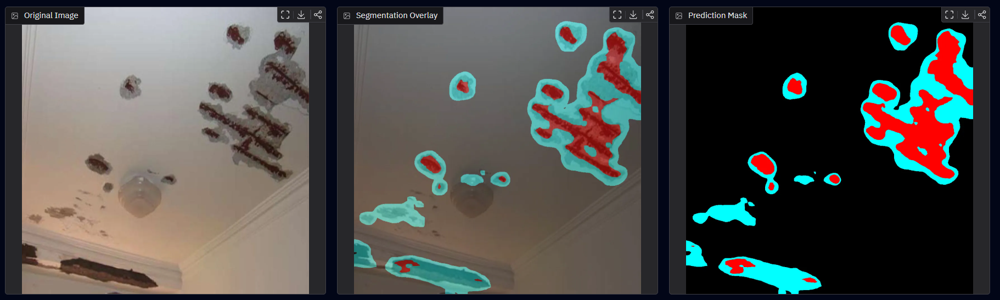
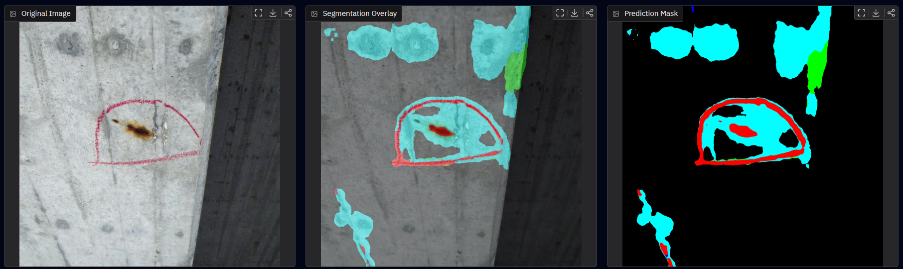
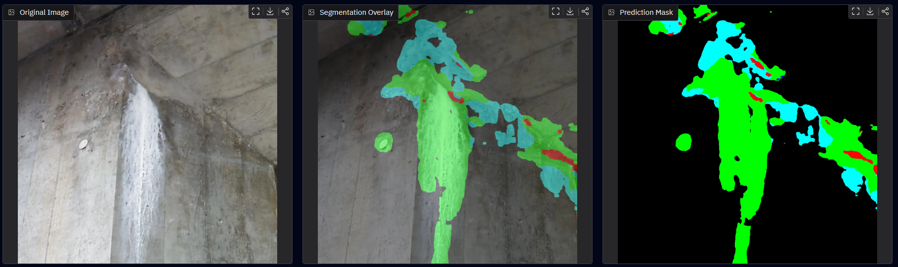
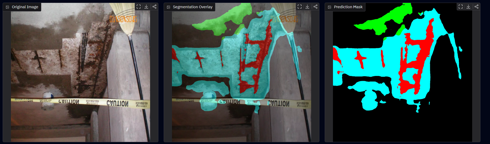
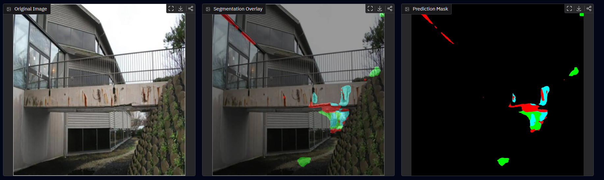

# 3.3 Evaluation & Metrics

## Evaluation Strategy

The model was evaluated on a held-out validation set that was not used during weight updates. Evaluation focused on segmentation-specific metrics that measure both pixel-level classification performance and mask quality.

### Selected Metrics

#### Mean Intersection over Union (mIoU)

* Mean Intersection over Union (mIoU) was selected as the primary evaluation metric because it directly measures the overlap between predicted segmentation masks and ground-truth annotations.
* mIoU penalizes both false positives and false negatives while providing balanced evaluation across all classes.
* For multi-class infrastructure defect segmentation, mIoU provides a more representative measure of performance than pixel accuracy alone.

#### Pixel Accuracy

* Pixel Accuracy measures the percentage of correctly classified pixels across the entire image.
* This metric provides an indication of overall prediction quality but can be misleading when background pixels dominate the dataset.
* Pixel Accuracy was therefore used as a secondary metric and interpreted together with mIoU.

#### Per-Class IoU

* Per-Class IoU evaluates segmentation quality for each defect category individually.
* Infrastructure inspection datasets are inherently imbalanced, with defect classes occupying significantly fewer pixels than background regions.
* Reporting class-level metrics exposes weaknesses that may be hidden by aggregate scores.

---

## Experiment Comparison

Several training configurations were evaluated to identify the optimal training strategy for SegFormer-B0.

### Experimental Results

| Experiment | Epochs | Learning Rate | Best Epoch | Best Validation mIoU | Final Epoch mIoU | Pixel Accuracy |
| ---------- | ------ | ------------- | ---------- | -------------------- | ---------------- | -------------- |
| Exp004     | 5      | 5e-05         | 5          | 0.447                | 0.447            | 0.922          |
| Exp005     | 30     | 1e-04         | 27         | 0.561            | 0.460            | 0.930          |
| Exp006     | 20     | 3e-05         | 16         | 0.511                | 0.491            | 0.940          |

### Observations

Several trends emerged during experimentation:

* Extending training duration improved segmentation quality when combined with an appropriate learning rate.
* Exp005 achieved the highest validation mIoU across all experiments
* Validation performance peaked at Epoch 27 before declining during later epochs, indicating mild overfitting.
* Exp006 produced more stable convergence but did not achieve the same peak segmentation performance as Exp005.
* Lower learning rates resulted in slower convergence and reduced peak performance.
* These results demonstrate the importance of selecting models using validation checkpoints rather than relying solely on the final training epoch.

Based on these results, **Exp005** was selected as the final model for deployment and qualitative evaluation.

---

## Final Model Performance

### Overall Metrics

The final deployed model corresponds to the best validation checkpoint.

| Metric               | Value             |
| -------------------- | ----------------- |
| Best Validation mIoU | **0.5611**        |
| Pixel Accuracy       | **0.9296**        |
| Training Duration    | **181.7 minutes** |

The model achieved strong segmentation performance while maintaining high pixel-level classification accuracy across all defect categories.

---

## Per-Class Results

| Class          | IoU    |
| -------------- | ------ |
| Background     | 0.932  |
| Crack          | 0.379  |
| Spalling       | 0.141  |
| Efflorescence  | 0.329  |
| Rebar Exposure | 0.505  |
| Mean IoU       | 0.460 |

---

### Class-Level Analysis

#### Background

Background achieved the highest IoU score.

This result is expected because background pixels represent the majority of the dataset and exhibit relatively consistent visual characteristics.

#### Rebar Exposure

Rebar achieved the strongest defect-class performance.

Exposed reinforcement bars often contain distinctive geometric structures, strong edges, and consistent visual patterns that are easier for the model to distinguish from surrounding concrete surfaces.

#### Efflorescence

Efflorescence achieved moderate segmentation performance.

The model generally detected large efflorescence regions successfully but occasionally confused subtle discoloration patterns with surrounding surface textures.

#### Crack

Crack segmentation proved significantly more challenging.

Cracks frequently appear as thin structures with widths of only a few pixels. Minor localization errors can substantially reduce IoU despite visually acceptable predictions.

#### Spalling

Spalling achieved the lowest IoU score among defect classes.

This category also contains the smallest number of annotated pixels in the dataset, making it particularly susceptible to class imbalance effects.

---

## Dataset Distribution Analysis

The dataset exhibits substantial class imbalance.

| Class          | Pixel Count |
| -------------- | ----------- |
| Background     | 116,207,621 |
| Crack          | 2,215,716   |
| Spalling       | 347,546     |
| Efflorescence  | 630,069     |
| Rebar Exposure | 4,593,160   |

Background pixels account for the overwhelming majority of observations.

Spalling represents less than 0.3% of all annotated pixels, making it the most difficult class to learn reliably.

This imbalance motivated the use of a combined Dice Loss and Weighted Cross Entropy Loss during training.

---

## Strengths

The final model demonstrated several strengths:

* Accurate localization of large defect regions.
* Strong segmentation performance on exposed reinforcement bars.
* Robust identification of defect boundaries under varying lighting conditions.
* Consistent background classification.
* Stable performance across multiple validation experiments.

The model proved particularly effective when defects occupied a meaningful portion of the image and exhibited clear visual contrast from surrounding surfaces.

---

## Failure Cases

Several failure modes were observed during evaluation.

### Thin Crack Segmentation

Very narrow cracks occasionally produced fragmented predictions.

Small localization errors resulted in substantial IoU degradation due to the limited width of crack annotations.

### Small Spalling Regions

Minor spalling regions were occasionally missed.

This behavior is likely caused by severe class imbalance and limited representation of small spalling instances during training.

### Boundary Uncertainty

Some predictions exhibited uncertainty around defect edges.

This behavior produced slightly enlarged or reduced masks compared with the ground-truth annotation.

### Texture Confusion

Surface staining, shadows, and concrete texture variations occasionally generated false positive predictions.

Although infrequent, these cases indicate that the model still relies partially on texture cues rather than defect-specific structural characteristics.

---

## Limitations

The current system remains subject to several limitations.

* Performance is constrained by dataset size and annotation quality.
* Severe class imbalance affects minority defect categories.
* Fine-grained crack segmentation remains challenging.
* Predictions are generated independently for each image and do not incorporate temporal information.
* The model operates at a fixed input resolution of 512×512, which may remove extremely small defect details.

These limitations represent opportunities for future improvement through additional data collection, improved annotation coverage, higher-resolution training, and advanced sampling strategies.

---

## Qualitative Analysis

The following examples shows both successful predictions and failure cases observed during evaluation.

### Example 1: Successful Crack Segmentation

**Observation**

The model successfully detected the primary crack structures in both images and preserved the overall crack topology, including branching patterns and intersections. Predicted masks closely follow the visible crack path with limited background activation. The model maintained continuity across long crack segments despite variations in crack width and concrete surface texture.

**Analysis**

Crack detection is inherently challenging because cracks occupy a very small number of pixels relative to the background. Small localization errors can significantly reduce IoU despite visually acceptable predictions.

In these examples, the model demonstrated strong feature extraction capability and successfully distinguished crack boundaries from surrounding concrete texture.

**Significance**

These results indicate that the model learned meaningful structural representations rather than relying solely on texture-based cues. This behavior is important for practical infrastructure inspection scenarios where crack morphology is often more informative than local appearance.

---

### Example 2: Good Efflorescence Detection

**Observation**

The model successfully identified large efflorescence regions and captured the dominant flow patterns extending from the source location. Most of the visible deposits were included in the predicted mask.

Minor false positives were observed around surrounding concrete surfaces, particularly near boundary transitions.

**Analysis**

Efflorescence exhibits relatively distinctive visual characteristics, including high brightness contrast and elongated flow patterns. These characteristics make large deposits easier to separate from background concrete surfaces.

The false positive regions suggest that the model occasionally associates bright surface discoloration with efflorescence.

**Significance**

The model demonstrates strong sensitivity to moisture-related degradation patterns, which are important indicators of water ingress and potential long-term structural deterioration.

---

### Example 3: Good Corrosion/Exposed Rebar & Spalling Detection

**Observation**

The model successfully segmented multiple defect categories within the same image, including exposed reinforcement bars, corrosion regions, and surrounding spalled concrete.

Predicted masks preserved the geometric structure of reinforcement bars while simultaneously identifying surrounding material loss.

**Analysis**

This example demonstrates effective multi-class segmentation performance. The model not only localized defects but also differentiated between defect categories occupying adjacent spatial regions.

The strong performance on exposed rebar aligns with the quantitative evaluation results, where rebar achieved the highest defect-class IoU.

**Significance**

The ability to distinguish between spalling and exposed reinforcement is operationally important because these defects often require different maintenance priorities and repair strategies.

---

### Example 4: Failed Corrosion Detection

**Observation**

The model detected the general defect region but failed to classify the corrosion area accurately. Significant portions of the annotated corrosion region were assigned to surrounding defect classes.

The prediction captured the existence of damage but did not produce correct class attribution.

**Root Cause Analysis**

Corrosion regions frequently exhibit high visual variability due to differences in lighting conditions, rust coloration, surface contamination, and camera viewpoint.

The limited number of corrosion examples in the training data likely reduced the model's ability to learn robust corrosion-specific features.

**Impact**

From an inspection perspective, the defect would still be flagged for review. However, incorrect classification may affect automated reporting and defect prioritization workflows.

**Potential Improvement**

Performance may improve through:

* Additional corrosion samples
* Class-balanced sampling strategies
* Higher-resolution training images

---

### Example 5: Failure Case: Detected Corrosion in Efflorescence & Spalling Image

**Observation**

The model correctly identified large portions of the efflorescence and spalling regions but incorrectly introduced corrosion predictions in areas where corrosion was not present.

These false positive corrosion detections occurred near class boundaries and regions with complex visual texture.

**Root Cause Analysis**

Efflorescence, spalling, and corrosion frequently co-occur in deteriorated infrastructure. As a result, visual boundaries between classes can become ambiguous.

The model appears to have learned correlations between defect categories and occasionally over-predicts corrosion when multiple degradation patterns exist within the same scene.

**Impact**

This behavior increases false positive rates and may result in overestimation of structural deterioration severity.

**Potential Improvement**

Future work could incorporate:

* Additional multi-label defect examples
* More detailed class annotations

---

### Example 6: Edge Case: Complex Surface Texture

**Observation**

The image contains challenging visual conditions including severe deterioration, multiple defect types, varying material textures, uneven lighting, and occlusions.

Despite these challenges, the model successfully identified major defect regions and preserved the overall spatial distribution of damage.

Some boundary inaccuracies and minor class confusion were observed.

**Analysis**

This example represents a realistic field inspection scenario where ideal imaging conditions cannot be assumed.

The model maintained stable performance despite substantial visual complexity, suggesting that learned representations generalize beyond clean laboratory-style examples.

**Significance**

This result provides evidence that the model can operate under practical inspection conditions and not only on well-controlled benchmark images.

### Example 7: Edge Case: Large-Scale Scene With Small Defects

**Observation**

The image contains a large structural scene where defects occupy only a very small percentage of total image pixels.

The model successfully detected several defect regions despite the substantial scale difference between the structure and the defects.

However, some small defect regions were missed and several predictions appeared fragmented.

**Analysis**

This scenario shows one of the primary challenges of fixed-resolution semantic segmentation.

When large scenes are resized to 512×512, small defects lose spatial detail and become increasingly difficult to detect.

The model still identified the most visually prominent defects, demonstrating partial robustness to scale variation.

**Significance**

This example shows the limitations of the current deployment configuration and showcase potential benefits of:

* Higher-resolution inference
* Sliding-window inference